# QRLP Cognitive Security Framework

## Table of Contents

- [Overview](#overview)
- [Cognitive Security Fundamentals](#cognitive-security-fundamentals)
- [QRLP's Role in Cognitive Security](#qrlps-role-in-cognitive-security)
- [Temporal Intelligence Framework](#temporal-intelligence-framework)
- [Cognitive Functions Integration](#cognitive-functions-integration)
- [Security Architecture](#security-architecture)
- [Use Cases and Applications](#use-cases-and-applications)
- [Implementation Strategies](#implementation-strategies)
- [Threat Modeling](#threat-modeling)
- [Future Developments](#future-developments)

## Overview

### What is Cognitive Security?

Cognitive Security refers to the protection of cognitive processes—thinking, reasoning, decision-making, and information processing—from manipulation, misinformation, and sophisticated attacks. In an era of deepfakes, AI-generated content, and information warfare, cognitive security becomes crucial for maintaining trust in digital communications.

### QRLP's Cognitive Security Mission

The QR Live Protocol (QRLP) serves as a **Temporal Intelligence Verification System** that provides cognitive security through:

- **Real-time authenticity verification** of information streams
- **Temporal anchoring** of content to verifiable timestamps
- **Multi-layered cryptographic validation** for cognitive trust
- **Blockchain-based immutable verification** against manipulation
- **Dynamic verification protocols** that adapt to emerging threats

## Cognitive Security Fundamentals

### The Cognitive Attack Surface

Modern cognitive attacks target multiple layers of human information processing:

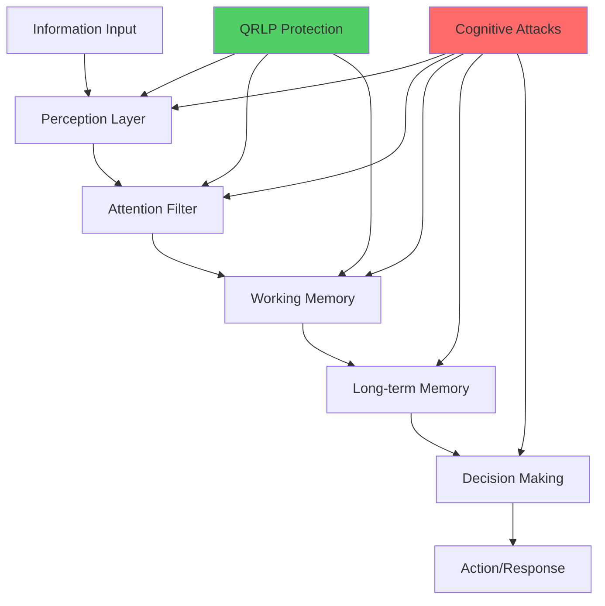
```mermaid
graph TD
    A["Information Input"] --> B["Perception Layer"]
    B --> C["Attention Filter"]
    C --> D["Working Memory"]
    D --> E["Long-term Memory"]
    E --> F["Decision Making"]
    F --> G["Action/Response"]
    
    H["Cognitive Attacks"] --> B
    H --> C
    H --> D
    H --> E
    H --> F
    
    I["QRLP Protection"] --> B
    I --> C
    I --> D
    
    style H fill:#ff6b6b
    style I fill:#51cf66
```

### Cognitive Vulnerabilities

1. **Temporal Disorientation** - Confusion about when events occurred
2. **Source Confusion** - Inability to verify information origins
3. **Context Collapse** - Loss of situational awareness
4. **Confirmation Bias Exploitation** - Targeted misinformation
5. **Cognitive Overload** - Information saturation attacks
6. **Trust Network Manipulation** - Compromised verification sources

### QRLP's Cognitive Protection Mechanisms

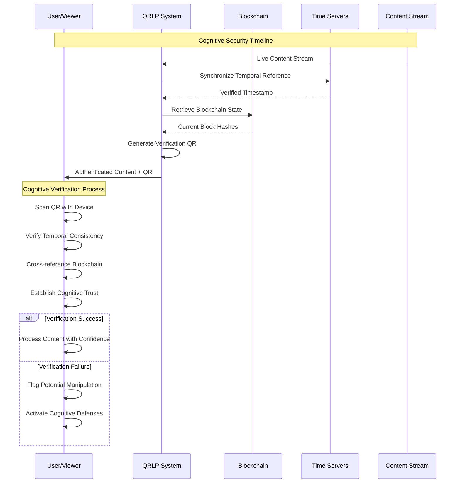
```mermaid
sequenceDiagram
    participant U as User/Viewer
    participant Q as QRLP System
    participant B as Blockchain
    participant T as Time Servers
    participant C as Content Stream
    
    Note over U,C: Cognitive Security Timeline
    
    C->>Q: Live Content Stream
    Q->>T: Synchronize Temporal Reference
    T-->>Q: Verified Timestamp
    Q->>B: Retrieve Blockchain State
    B-->>Q: Current Block Hashes
    Q->>Q: Generate Verification QR
    Q->>U: Authenticated Content + QR
    
    Note over U: Cognitive Verification Process
    U->>U: Scan QR with Device
    U->>U: Verify Temporal Consistency
    U->>U: Cross-reference Blockchain
    U->>U: Establish Cognitive Trust
    
    alt Verification Success
        U->>U: Process Content with Confidence
    else Verification Failure
        U->>U: Flag Potential Manipulation
        U->>U: Activate Cognitive Defenses
    end
```

## QRLP's Role in Cognitive Security

### Temporal Anchoring for Cognitive Trust

QRLP creates **temporal anchors** that serve as cognitive reference points:

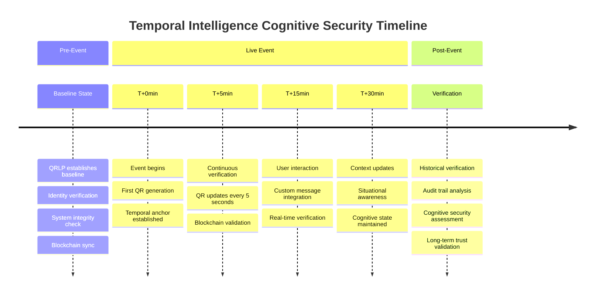
```mermaid
timeline
    title Temporal Intelligence Cognitive Security Timeline
    
    section Pre-Event
        Baseline State    : QRLP establishes baseline
                         : Identity verification
                         : System integrity check
                         : Blockchain sync
    
    section Live Event
        T+0min           : Event begins
                        : First QR generation
                        : Temporal anchor established
        T+5min          : Continuous verification
                        : QR updates every 5 seconds
                        : Blockchain validation
        T+15min         : User interaction
                        : Custom message integration
                        : Real-time verification
        T+30min         : Context updates
                        : Situational awareness
                        : Cognitive state maintained
    
    section Post-Event
        Verification     : Historical verification
                        : Audit trail analysis
                        : Cognitive security assessment
                        : Long-term trust validation
```

### Multi-Layer Cognitive Verification

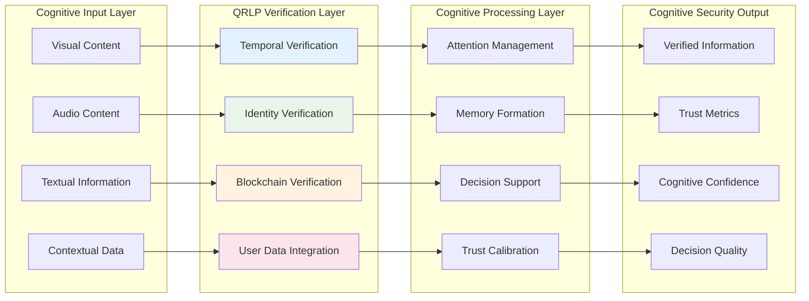
```mermaid
graph LR
    subgraph "Cognitive Input Layer"
        A[Visual Content]
        B[Audio Content]
        C[Textual Information]
        D[Contextual Data]
    end
    
    subgraph "QRLP Verification Layer"
        E[Temporal Verification]
        F[Identity Verification]
        G[Blockchain Verification]
        H[User Data Integration]
    end
    
    subgraph "Cognitive Processing Layer"
        I[Attention Management]
        J[Memory Formation]
        K[Decision Support]
        L[Trust Calibration]
    end
    
    subgraph "Cognitive Security Output"
        M[Verified Information]
        N[Trust Metrics]
        O[Cognitive Confidence]
        P[Decision Quality]
    end
    
    A --> E
    B --> F
    C --> G
    D --> H
    
    E --> I
    F --> J
    G --> K
    H --> L
    
    I --> M
    J --> N
    K --> O
    L --> P
    
    style E fill:#e3f2fd
    style F fill:#e8f5e8
    style G fill:#fff3e0
    style H fill:#fce4ec
```

## Temporal Intelligence Framework

### The Cognitive Temporal Model

QRLP implements a sophisticated temporal intelligence model that supports cognitive security:

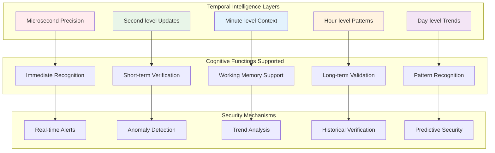
```mermaid
graph TB
    subgraph "Temporal Intelligence Layers"
        A[Microsecond Precision]
        B[Second-level Updates]
        C[Minute-level Context]
        D[Hour-level Patterns]
        E[Day-level Trends]
    end
    
    subgraph "Cognitive Functions Supported"
        F[Immediate Recognition]
        G[Short-term Verification]
        H[Working Memory Support]
        I[Long-term Validation]
        J[Pattern Recognition]
    end
    
    subgraph "Security Mechanisms"
        K[Real-time Alerts]
        L[Anomaly Detection]
        M[Trend Analysis]
        N[Historical Verification]
        O[Predictive Security]
    end
    
    A --> F --> K
    B --> G --> L
    C --> H --> M
    D --> I --> N
    E --> J --> O
    
    style A fill:#ffebee
    style B fill:#e8f5e8
    style C fill:#e3f2fd
    style D fill:#fff3e0
    style E fill:#f3e5f5
```

### Temporal Consistency Validation

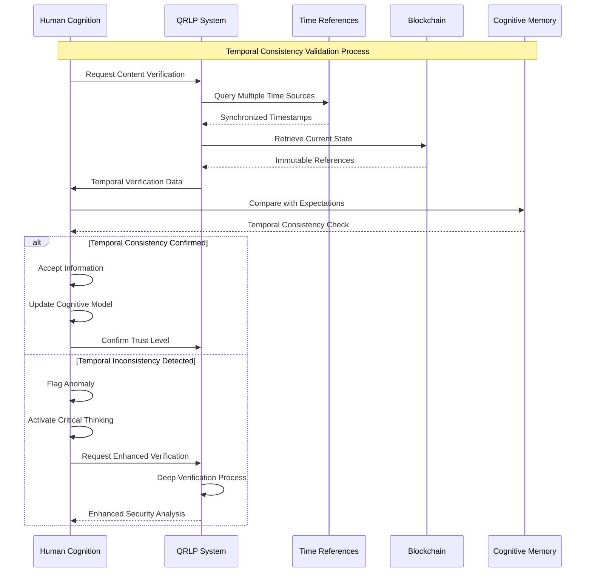
```mermaid
sequenceDiagram
    participant Brain as Human Cognition
    participant QRLP as QRLP System
    participant Time as Time References
    participant Block as Blockchain
    participant Memory as Cognitive Memory
    
    Note over Brain,Memory: Temporal Consistency Validation Process
    
    Brain->>QRLP: Request Content Verification
    QRLP->>Time: Query Multiple Time Sources
    Time-->>QRLP: Synchronized Timestamps
    QRLP->>Block: Retrieve Current State
    Block-->>QRLP: Immutable References
    QRLP->>Brain: Temporal Verification Data
    
    Brain->>Memory: Compare with Expectations
    Memory-->>Brain: Temporal Consistency Check
    
    alt Temporal Consistency Confirmed
        Brain->>Brain: Accept Information
        Brain->>Brain: Update Cognitive Model
        Brain->>QRLP: Confirm Trust Level
    else Temporal Inconsistency Detected
        Brain->>Brain: Flag Anomaly
        Brain->>Brain: Activate Critical Thinking
        Brain->>QRLP: Request Enhanced Verification
        QRLP->>QRLP: Deep Verification Process
        QRLP-->>Brain: Enhanced Security Analysis
    end
```

## Cognitive Functions Integration

### Attention Management

QRLP supports cognitive attention management through:

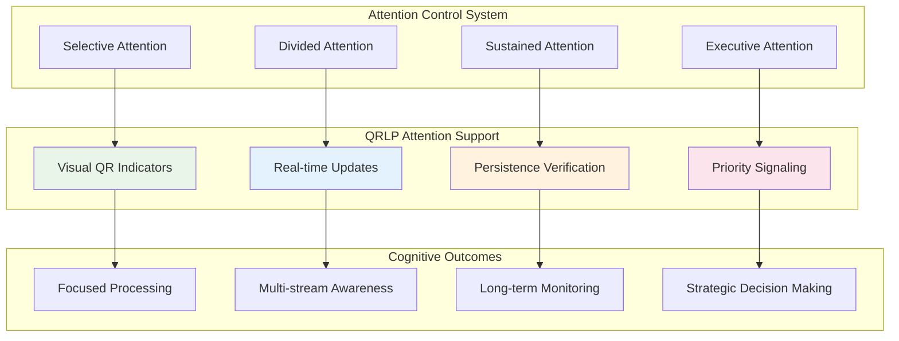
```mermaid
graph TD
    subgraph "Attention Control System"
        A[Selective Attention]
        B[Divided Attention]
        C[Sustained Attention]
        D[Executive Attention]
    end
    
    subgraph "QRLP Attention Support"
        E[Visual QR Indicators]
        F[Real-time Updates]
        G[Persistence Verification]
        H[Priority Signaling]
    end
    
    subgraph "Cognitive Outcomes"
        I[Focused Processing]
        J[Multi-stream Awareness]
        K[Long-term Monitoring]
        L[Strategic Decision Making]
    end
    
    A --> E --> I
    B --> F --> J
    C --> G --> K
    D --> H --> L
    
    style E fill:#e8f5e8
    style F fill:#e3f2fd
    style G fill:#fff3e0
    style H fill:#fce4ec
```

### Memory Formation and Validation

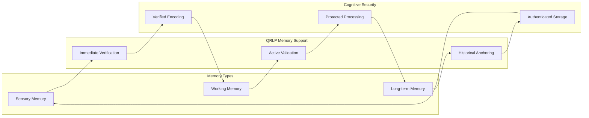
```mermaid
flowchart LR
    subgraph "Memory Types"
        A[Sensory Memory]
        B[Working Memory]
        C[Long-term Memory]
    end
    
    subgraph "QRLP Memory Support"
        D[Immediate Verification]
        E[Active Validation]
        F[Historical Anchoring]
    end
    
    subgraph "Cognitive Security"
        G[Verified Encoding]
        H[Protected Processing]
        I[Authenticated Storage]
    end
    
    A --> D --> G
    B --> E --> H
    C --> F --> I
    
    G --> B
    H --> C
    I --> A
```

### Decision Support Framework

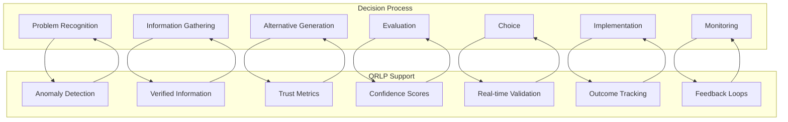
```mermaid
graph TB
    subgraph "Decision Process"
        A[Problem Recognition]
        B[Information Gathering]
        C[Alternative Generation]
        D[Evaluation]
        E[Choice]
        F[Implementation]
        G[Monitoring]
    end
    
    subgraph "QRLP Support"
        H[Anomaly Detection]
        I[Verified Information]
        J[Trust Metrics]
        K[Confidence Scores]
        L[Real-time Validation]
        M[Outcome Tracking]
        N[Feedback Loops]
    end
    
    A --> H
    B --> I
    C --> J
    D --> K
    E --> L
    F --> M
    G --> N
    
    H --> A
    I --> B
    J --> C
    K --> D
    L --> E
    M --> F
    N --> G
```

## Security Architecture

### Cognitive Threat Detection

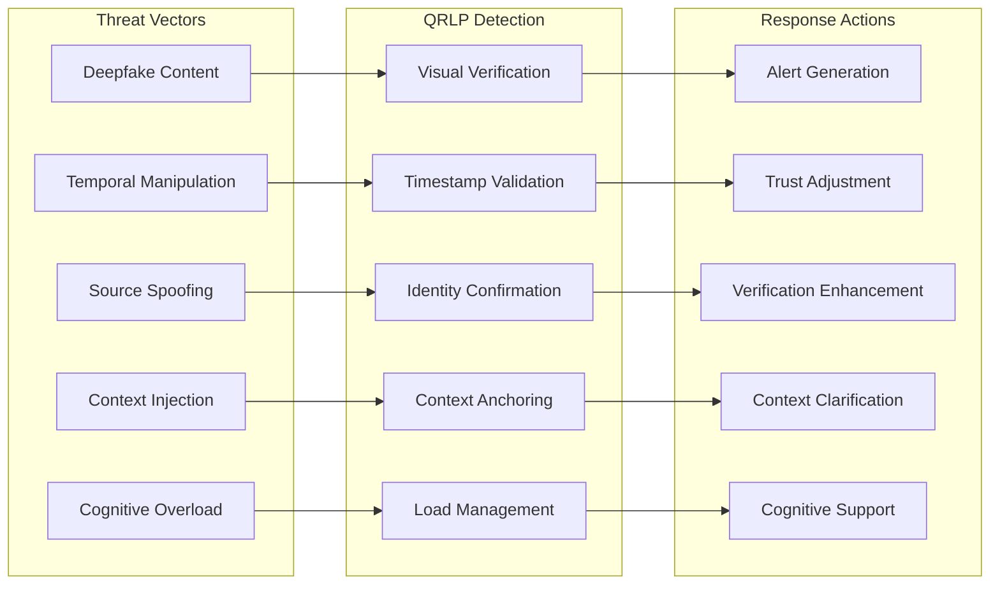
```mermaid
graph LR
    subgraph "Threat Vectors"
        A[Deepfake Content]
        B[Temporal Manipulation]
        C[Source Spoofing]
        D[Context Injection]
        E[Cognitive Overload]
    end
    
    subgraph "QRLP Detection"
        F[Visual Verification]
        G[Timestamp Validation]
        H[Identity Confirmation]
        I[Context Anchoring]
        J[Load Management]
    end
    
    subgraph "Response Actions"
        K[Alert Generation]
        L[Trust Adjustment]
        M[Verification Enhancement]
        N[Context Clarification]
        O[Cognitive Support]
    end
    
    A --> F --> K
    B --> G --> L
    C --> H --> M
    D --> I --> N
    E --> J --> O
```

### Multi-Modal Verification System

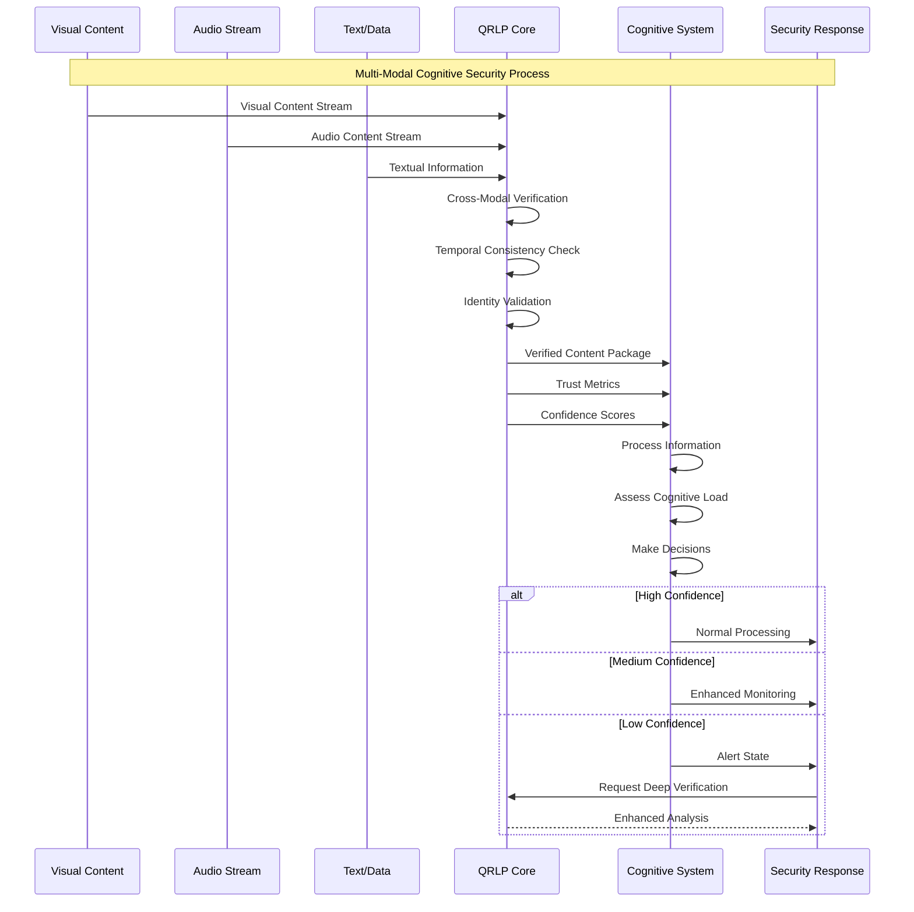
```mermaid
sequenceDiagram
    participant Visual as Visual Content
    participant Audio as Audio Stream
    participant Text as Text/Data
    participant QRLP as QRLP Core
    participant Cognitive as Cognitive System
    participant Security as Security Response
    
    Note over Visual,Security: Multi-Modal Cognitive Security Process
    
    Visual->>QRLP: Visual Content Stream
    Audio->>QRLP: Audio Content Stream
    Text->>QRLP: Textual Information
    
    QRLP->>QRLP: Cross-Modal Verification
    QRLP->>QRLP: Temporal Consistency Check
    QRLP->>QRLP: Identity Validation
    
    QRLP->>Cognitive: Verified Content Package
    QRLP->>Cognitive: Trust Metrics
    QRLP->>Cognitive: Confidence Scores
    
    Cognitive->>Cognitive: Process Information
    Cognitive->>Cognitive: Assess Cognitive Load
    Cognitive->>Cognitive: Make Decisions
    
    alt High Confidence
        Cognitive->>Security: Normal Processing
    else Medium Confidence
        Cognitive->>Security: Enhanced Monitoring
    else Low Confidence
        Cognitive->>Security: Alert State
        Security->>QRLP: Request Deep Verification
        QRLP-->>Security: Enhanced Analysis
    end
```

## Use Cases and Applications

### News and Journalism

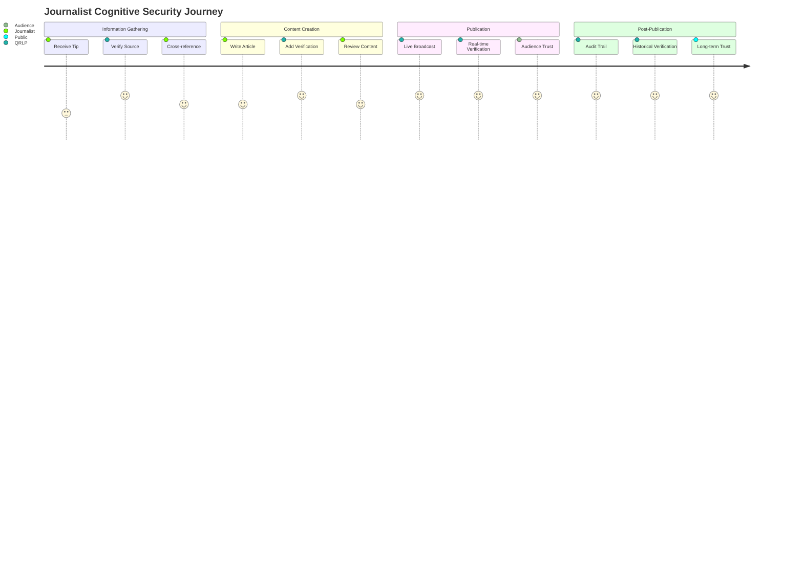
```mermaid
journey
    title Journalist Cognitive Security Journey
    section Information Gathering
        Receive Tip: 3: Journalist
        Verify Source: 5: QRLP
        Cross-reference: 4: Journalist
    section Content Creation
        Write Article: 4: Journalist
        Add Verification: 5: QRLP
        Review Content: 4: Journalist
    section Publication
        Live Broadcast: 5: QRLP
        Real-time Verification: 5: QRLP
        Audience Trust: 5: Audience
    section Post-Publication
        Audit Trail: 5: QRLP
        Historical Verification: 5: QRLP
        Long-term Trust: 5: Public
```

### Educational Content Verification

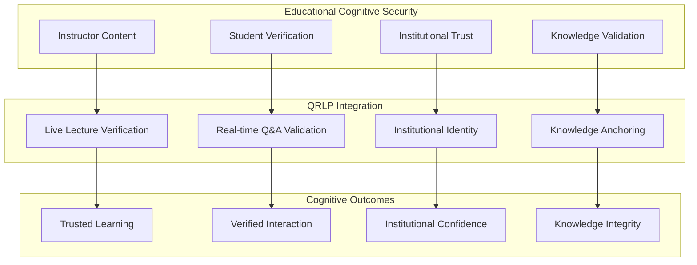
```mermaid
graph TD
    subgraph "Educational Cognitive Security"
        A[Instructor Content]
        B[Student Verification]
        C[Institutional Trust]
        D[Knowledge Validation]
    end
    
    subgraph "QRLP Integration"
        E[Live Lecture Verification]
        F[Real-time Q&A Validation]
        G[Institutional Identity]
        H[Knowledge Anchoring]
    end
    
    subgraph "Cognitive Outcomes"
        I[Trusted Learning]
        J[Verified Interaction]
        K[Institutional Confidence]
        L[Knowledge Integrity]
    end
    
    A --> E --> I
    B --> F --> J
    C --> G --> K
    D --> H --> L
```

### Legal and Compliance

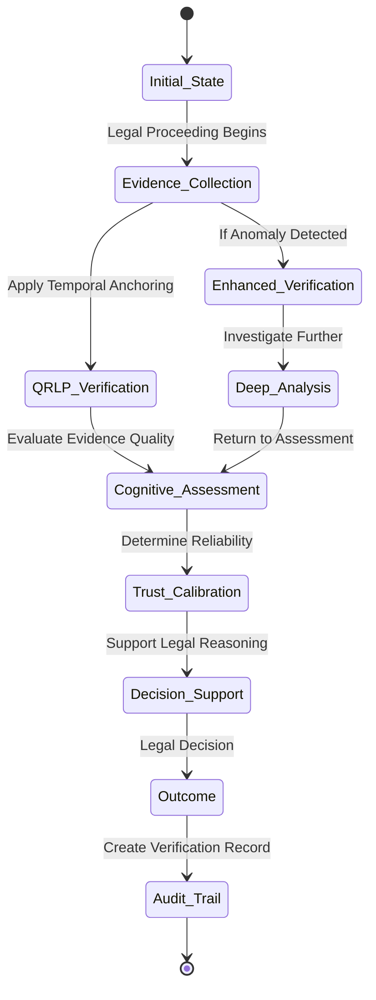
```mermaid
stateDiagram-v2
    [*] --> Initial_State
    Initial_State --> Evidence_Collection: Legal Proceeding Begins
    Evidence_Collection --> QRLP_Verification: Apply Temporal Anchoring
    QRLP_Verification --> Cognitive_Assessment: Evaluate Evidence Quality
    Cognitive_Assessment --> Trust_Calibration: Determine Reliability
    Trust_Calibration --> Decision_Support: Support Legal Reasoning
    Decision_Support --> Outcome: Legal Decision
    Outcome --> Audit_Trail: Create Verification Record
    Audit_Trail --> [*]
    
    Evidence_Collection --> Enhanced_Verification: If Anomaly Detected
    Enhanced_Verification --> Deep_Analysis: Investigate Further
    Deep_Analysis --> Cognitive_Assessment: Return to Assessment
```

## Implementation Strategies

### Cognitive Security Deployment

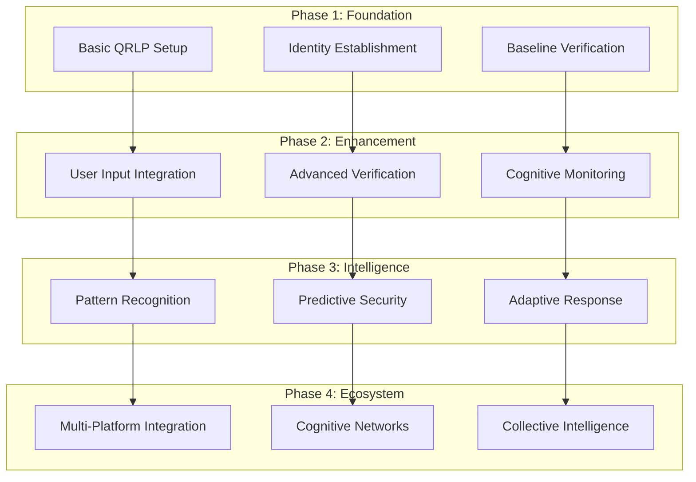
```mermaid
graph TB
    subgraph "Phase 1: Foundation"
        A[Basic QRLP Setup]
        B[Identity Establishment]
        C[Baseline Verification]
    end
    
    subgraph "Phase 2: Enhancement"
        D[User Input Integration]
        E[Advanced Verification]
        F[Cognitive Monitoring]
    end
    
    subgraph "Phase 3: Intelligence"
        G[Pattern Recognition]
        H[Predictive Security]
        I[Adaptive Response]
    end
    
    subgraph "Phase 4: Ecosystem"
        J[Multi-Platform Integration]
        K[Cognitive Networks]
        L[Collective Intelligence]
    end
    
    A --> D --> G --> J
    B --> E --> H --> K
    C --> F --> I --> L
```

### Integration Patterns

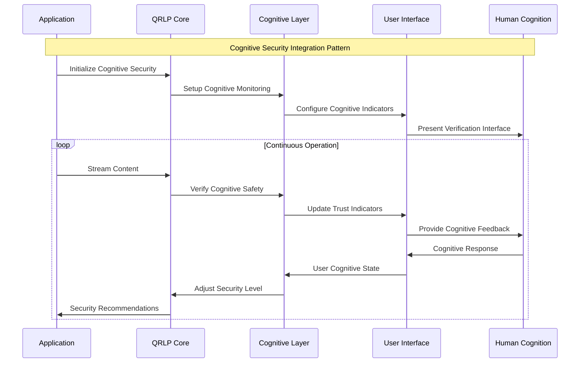
```mermaid
sequenceDiagram
    participant App as Application
    participant QRLP as QRLP Core
    participant Cog as Cognitive Layer
    participant UI as User Interface
    participant Brain as Human Cognition
    
    Note over App,Brain: Cognitive Security Integration Pattern
    
    App->>QRLP: Initialize Cognitive Security
    QRLP->>Cog: Setup Cognitive Monitoring
    Cog->>UI: Configure Cognitive Indicators
    UI->>Brain: Present Verification Interface
    
    loop Continuous Operation
        App->>QRLP: Stream Content
        QRLP->>Cog: Verify Cognitive Safety
        Cog->>UI: Update Trust Indicators
        UI->>Brain: Provide Cognitive Feedback
        Brain->>UI: Cognitive Response
        UI->>Cog: User Cognitive State
        Cog->>QRLP: Adjust Security Level
        QRLP->>App: Security Recommendations
    end
```

## Threat Modeling

### Cognitive Attack Scenarios

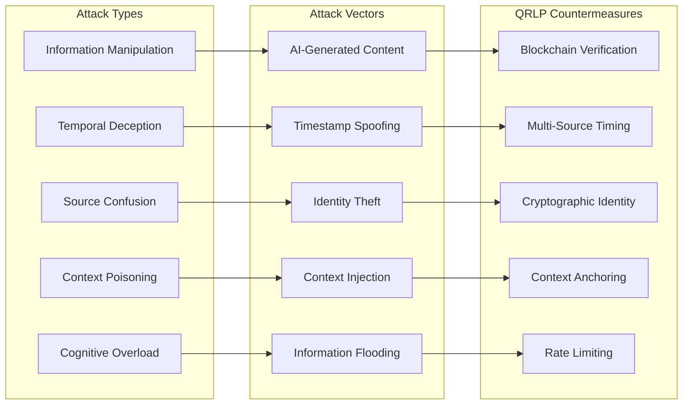
```mermaid
graph LR
    subgraph "Attack Types"
        A[Information Manipulation]
        B[Temporal Deception]
        C[Source Confusion]
        D[Context Poisoning]
        E[Cognitive Overload]
    end
    
    subgraph "Attack Vectors"
        F[AI-Generated Content]
        G[Timestamp Spoofing]
        H[Identity Theft]
        I[Context Injection]
        J[Information Flooding]
    end
    
    subgraph "QRLP Countermeasures"
        K[Blockchain Verification]
        L[Multi-Source Timing]
        M[Cryptographic Identity]
        N[Context Anchoring]
        O[Rate Limiting]
    end
    
    A --> F --> K
    B --> G --> L
    C --> H --> M
    D --> I --> N
    E --> J --> O
```

### Adaptive Security Response

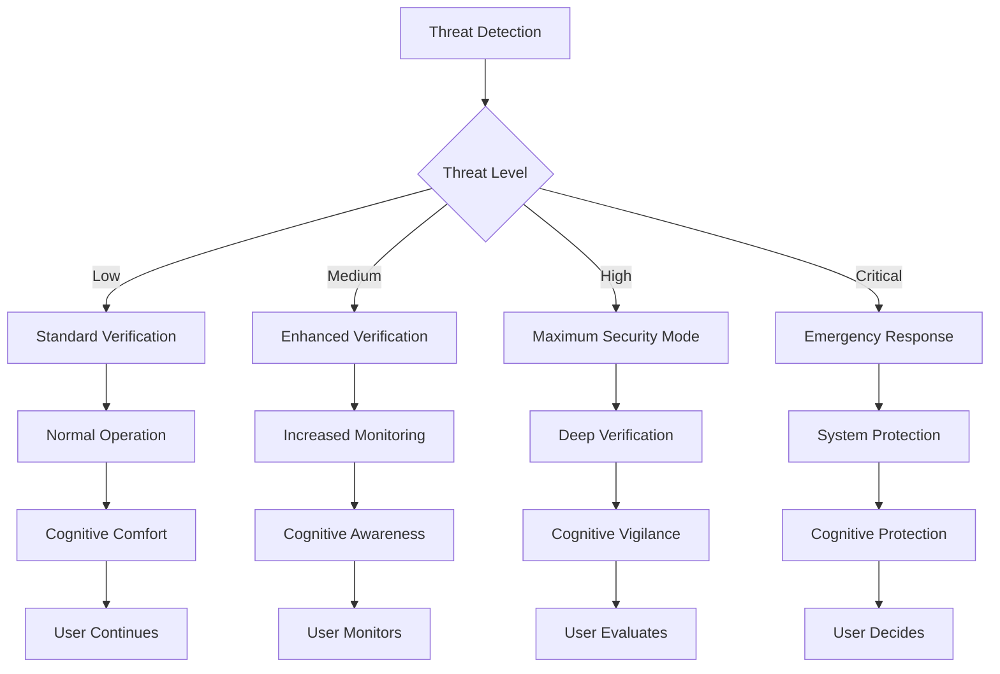
```mermaid
flowchart TD
    A[Threat Detection] --> B{Threat Level}
    B -->|Low| C[Standard Verification]
    B -->|Medium| D[Enhanced Verification]
    B -->|High| E[Maximum Security Mode]
    B -->|Critical| F[Emergency Response]
    
    C --> G[Normal Operation]
    D --> H[Increased Monitoring]
    E --> I[Deep Verification]
    F --> J[System Protection]
    
    G --> K[Cognitive Comfort]
    H --> L[Cognitive Awareness]
    I --> M[Cognitive Vigilance]
    J --> N[Cognitive Protection]
    
    K --> O[User Continues]
    L --> P[User Monitors]
    M --> Q[User Evaluates]
    N --> R[User Decides]
```

## Future Developments

### Emerging Cognitive Security Technologies

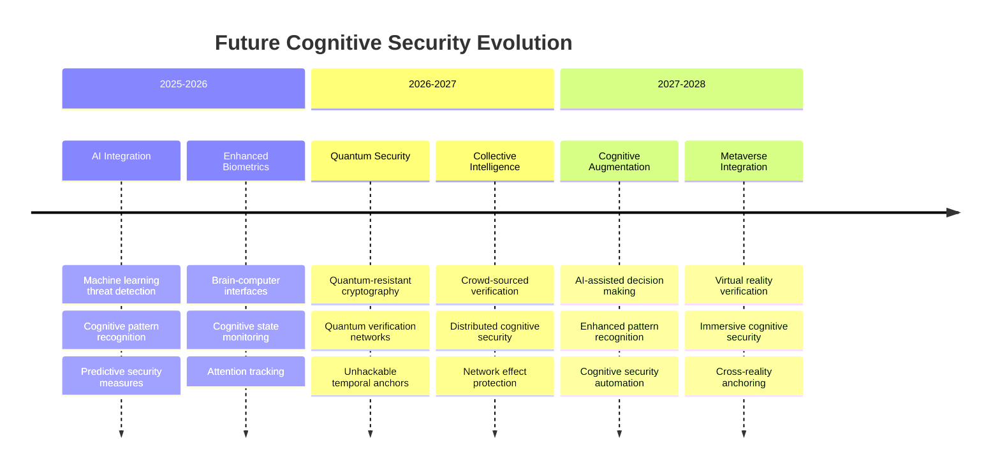
```mermaid
timeline
    title Future Cognitive Security Evolution
    
    section 2025-2026
        AI Integration        : Machine learning threat detection
                             : Cognitive pattern recognition
                             : Predictive security measures
        
        Enhanced Biometrics   : Brain-computer interfaces
                             : Cognitive state monitoring
                             : Attention tracking
    
    section 2026-2027
        Quantum Security      : Quantum-resistant cryptography
                             : Quantum verification networks
                             : Unhackable temporal anchors
        
        Collective Intelligence : Crowd-sourced verification
                              : Distributed cognitive security
                              : Network effect protection
    
    section 2027-2028
        Cognitive Augmentation : AI-assisted decision making
                              : Enhanced pattern recognition
                              : Cognitive security automation
        
        Metaverse Integration  : Virtual reality verification
                              : Immersive cognitive security
                              : Cross-reality anchoring
```

### Advanced Cognitive Models

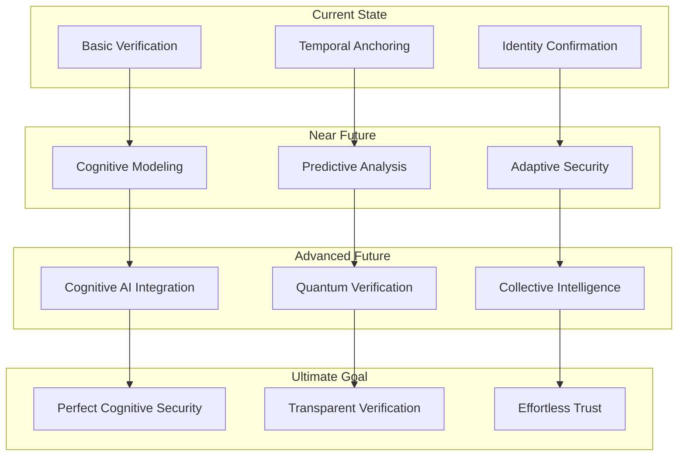
```mermaid
graph TB
    subgraph "Current State"
        A[Basic Verification]
        B[Temporal Anchoring]
        C[Identity Confirmation]
    end
    
    subgraph "Near Future"
        D[Cognitive Modeling]
        E[Predictive Analysis]
        F[Adaptive Security]
    end
    
    subgraph "Advanced Future"
        G[Cognitive AI Integration]
        H[Quantum Verification]
        I[Collective Intelligence]
    end
    
    subgraph "Ultimate Goal"
        J[Perfect Cognitive Security]
        K[Transparent Verification]
        L[Effortless Trust]
    end
    
    A --> D --> G --> J
    B --> E --> H --> K
    C --> F --> I --> L
```

## Conclusion

QRLP represents a paradigm shift in cognitive security, providing temporal intelligence that serves as a foundation for human cognitive trust in digital environments. By anchoring information to verifiable temporal and cryptographic references, QRLP enables humans to maintain cognitive security in an era of increasingly sophisticated information manipulation.

The integration of temporal intelligence, blockchain verification, and real-time user interaction creates a comprehensive cognitive security framework that adapts to emerging threats while supporting human cognitive functions. As we advance toward more complex digital environments, QRLP's cognitive security framework will continue to evolve, providing essential protection for human cognition in the digital age.

### Key Cognitive Security Benefits

1. **Temporal Anchoring** - Provides cognitive reference points for information processing
2. **Trust Calibration** - Helps humans adjust trust levels based on verification
3. **Attention Management** - Supports cognitive attention allocation
4. **Memory Validation** - Protects memory formation and retrieval processes
5. **Decision Support** - Enhances decision-making through verified information
6. **Cognitive Load Management** - Reduces cognitive burden of verification
7. **Pattern Recognition** - Assists in identifying cognitive threats
8. **Collective Intelligence** - Enables distributed cognitive security

---

**For more information about QRLP's cognitive security capabilities, see:**
- [Security Policy](SECURITY.md)
- [API Reference](API.md)
- [Implementation Guide](INSTALLATION.md)
- [Streaming Integration](STREAMING.md) 